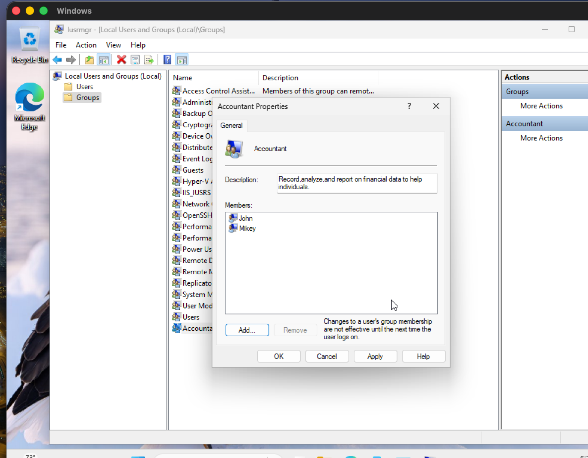
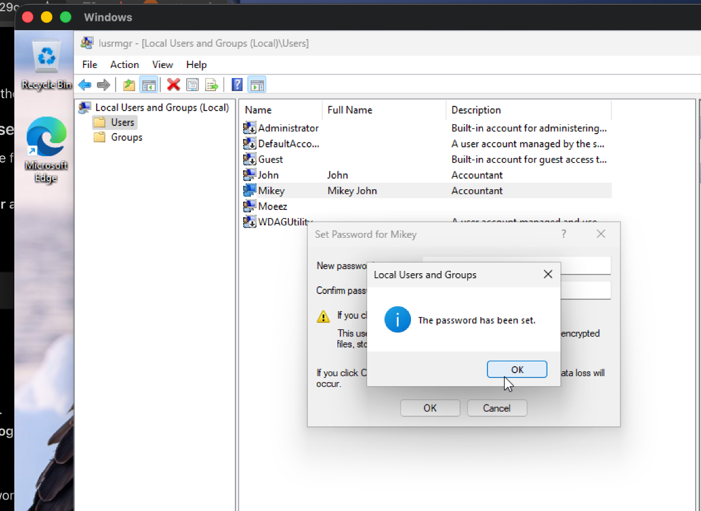
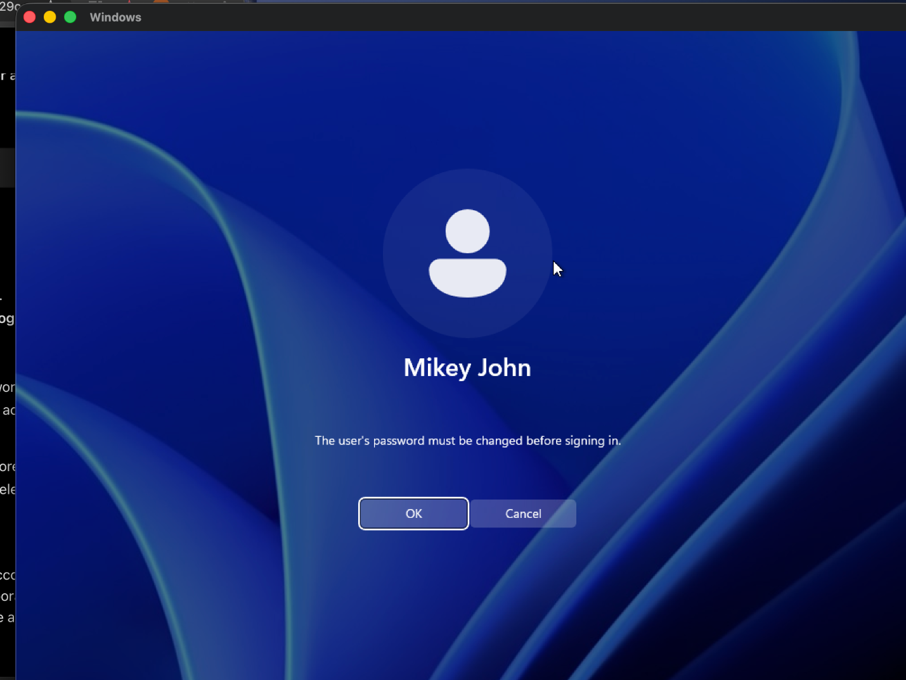
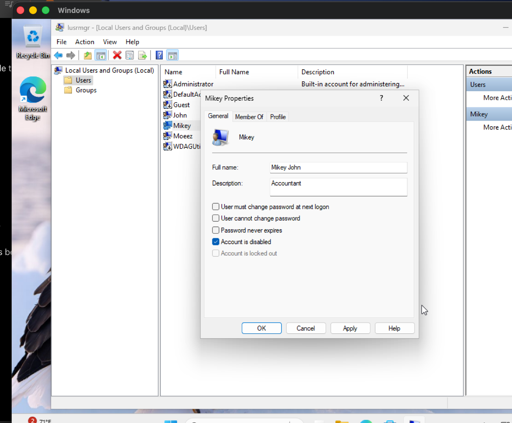
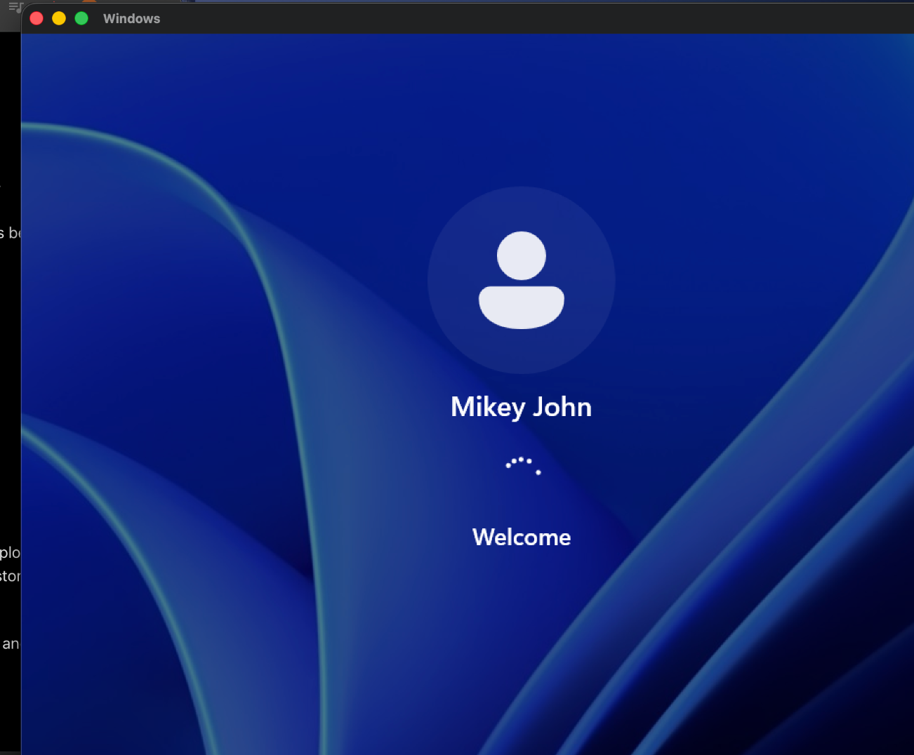
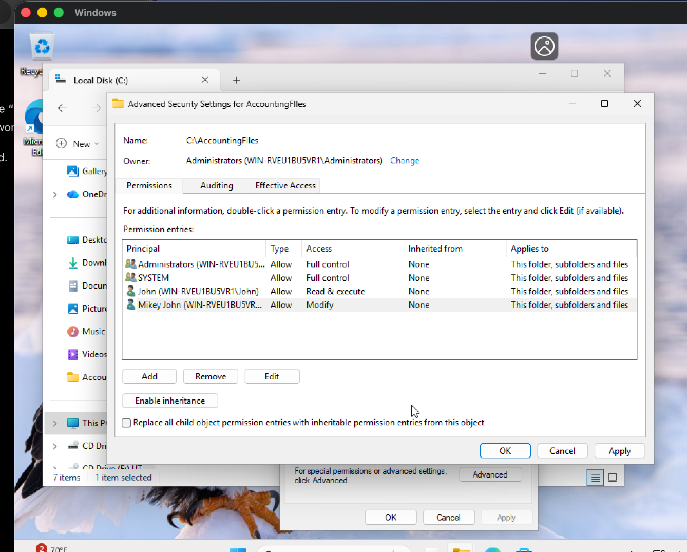
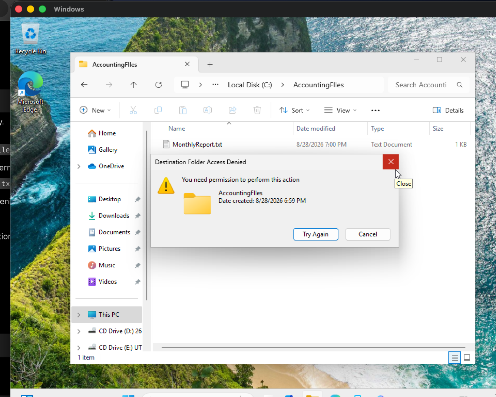
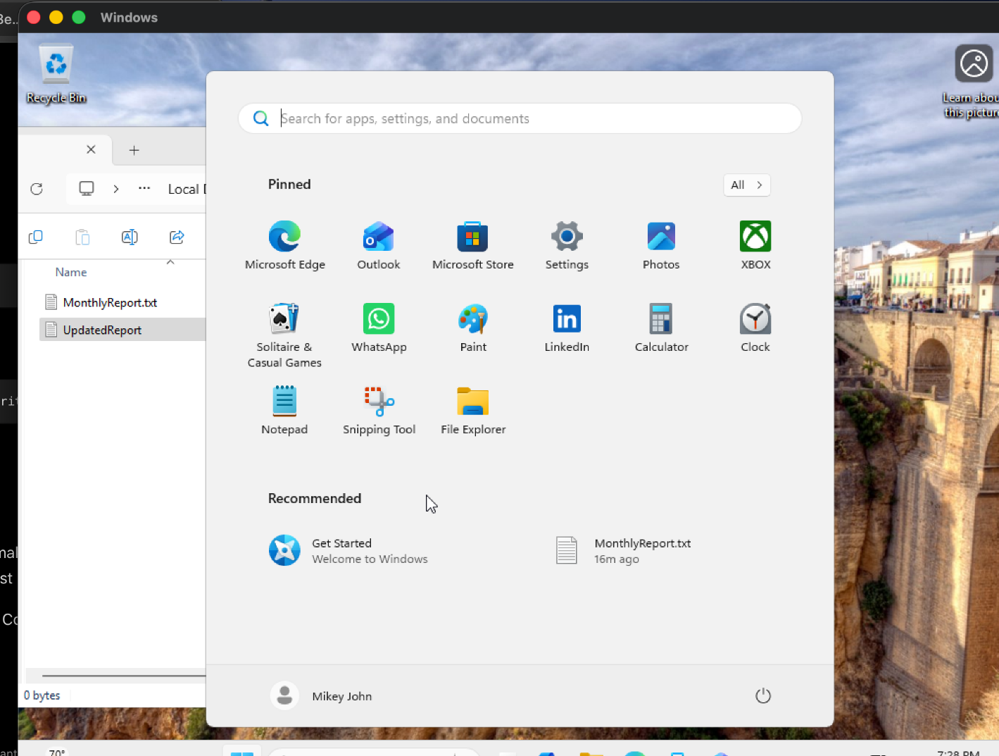
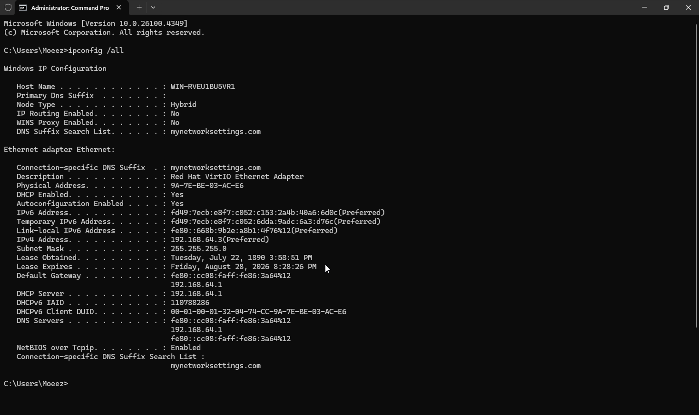
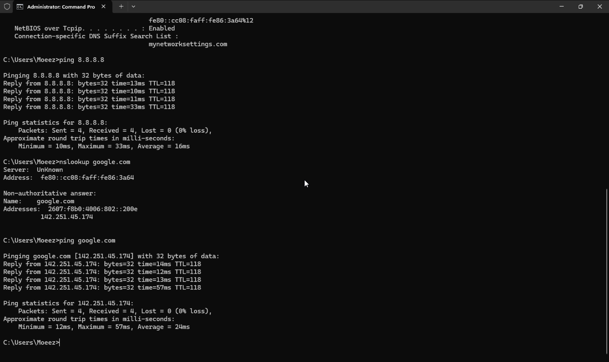

# Windows 11 IT Support Home Lab

A hands on IT support lab completed in a Windows 11 virtual machine. This project demonstrates troubleshooting, local user administration, password resets, account security, NTFS permissions, and network diagnostics through five simulated help desk tickets.

## Lab Environment

* Windows 11 virtual machine
* UTM virtualization on an Apple Silicon Mac
* Local Users and Groups (`lusrmgr.msc`)
* Windows File Explorer
* NTFS security permissions
* Command Prompt
* TCP/IP, DHCP and DNS troubleshooting

## Skills Demonstrated

* Creating and managing local user accounts
* Organizing users into departmental groups
* Resetting passwords and enforcing password changes
* Disabling and restoring user accounts
* Configuring NTFS folder permissions
* Applying least-privilege access
* Troubleshooting IP connectivity and DNS resolution
* Documenting technical work with screenshots

## Help-Desk Tickets

### Ticket 1: Create Users and Departmental Group

**Issue:** Accounting employees required local Windows accounts and membership in a departmental security group.

**Resolution:**

* Created local accounts for John and Mikey.
* Created an Accounting group.
* Added both users to the group.
* Verified the group membership.

---

### Ticket 2: Reset a Forgotten Password

**Issue:** A user could not access their account after forgetting their password.

**Resolution:**

* Verified the correct local user account.
* Reset the password using Local Users and Groups.
* Issued a temporary password.
* Required the user to change the password at the next sign-in.
* Confirmed that the account could sign in successfully.

---

### Ticket 3: Disable and Restore an Employee Account

**Issue:** An employee account needed to be temporarily disabled and later restored after authorization.

**Resolution:**

* Located the user in Local Users and Groups.
* Disabled the account.
* Confirmed the account status.
* Re-enabled the account after simulated authorization.
* Verified that the user could sign in again.

---

### Ticket 4: Configure Departmental Folder Permissions

**Issue:** Accounting employees required different access levels to a shared folder.

**Resolution:**

* Created `C:\AccountingFiles`.
* Assigned John **Read & execute** access.
* Assigned Mikey **Modify** access.
* Kept SYSTEM and Administrators with Full Control.
* Verified that John could read files but could not modify them.
* Verified that Mikey could create and rename files.

---

### Ticket 5: Network and DNS Troubleshooting

**Issue:** A workstation required network-connectivity and name-resolution testing.

**Resolution:**

* Used `ipconfig /all` to identify the IPv4 address, subnet mask, default gateway, DHCP server and DNS server.
* Used `ping 8.8.8.8` to verify IP connectivity.
* Used `nslookup google.com` to test DNS resolution.
* Used `ping google.com` to confirm hostname resolution and connectivity.
* Verified successful responses with zero packet loss.

## Key Takeaways

This project strengthened my ability to approach support requests as documented tickets: identify the problem, apply an appropriate solution, verify the result and preserve evidence. It also provided practical experience with Windows administration and troubleshooting concepts covered by CompTIA A+.
